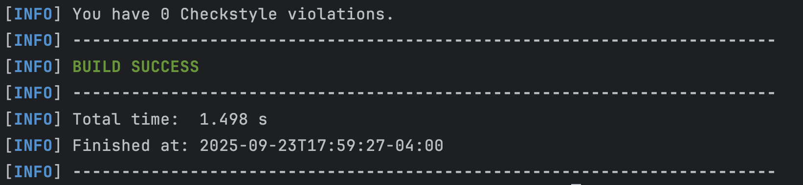
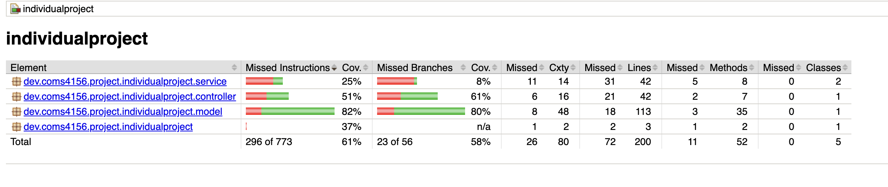

# Stanley Chung 4156-Miniproject-Fall 2025

Built on 4156-Miniproject-2025-Students starter code

# Building and Running a Local Instance
To In order to build and use our service you must install the following (This guide assumes MacOS but the Maven README has instructions for both Windows and Mac):

1. Maven 3.9.5: https://maven.apache.org/download.cgi Download and follow the installation instructions, be sure to set the bin as described in Maven's README as a new path variable by editing the system variables if you are on windows or by following the instructions for MacOS.
2. JDK 17: This project used JDK 17 for development so that is what we recommend you use: https://www.oracle.com/java/technologies/javase/jdk17-archive-downloads.html
3. IntelliJ IDE: We recommend using IntelliJ but you are free to use any other IDE that you are comfortable with: https://www.jetbrains.com/idea/download/?section=windows
4. When you open IntelliJ you may clone this repo using the link: https://github.com/StanleyC2/Stanley-Chung-ASE-I2.git
5. run `cd IndividualProject` to the working directory
6. To build the project with maven, run `mvn -B package --file pom.xml` and then you can either run the tests via the test files described below or the main application by running the .jar artifact in the target/ directory.
7. If you wish to run the style checker you can with mvn checkstyle:check or mvn checkstyle:checkstyle if you wish to generate the report.

# Running and Creating Tests
Unit tests are located under the directory 'src/test'. To run our project's tests in IntelliJ using Java 17, you must first build the project. Then, run `mvn clean test` and `mvn jacoco:report` for coverage report found in target/site/jacoco directory.

# Endpoints
This section describes the endpoints that our service provides, as well as their inputs and outputs. See the "Postman Test Documentation" section for in-depth examples of use cases and inputs/outputs, especially for file uploads and downloads.

 

**GET /book/{id}**
* Expected Input Parameters: **int id**
* Expected Output: Book information in the response body
* Searches the book by id from the database
* Upon Success: HTTP 200 Status Code is returned along with the book info in the response body
* Upon Failure: HTTP 404 Status Code is returned along with "Book not found" in the response body

**GET /books/available**
* Expected Input Parameters: N/A
* Expected Output: List of all books in the response body
* Returns all books in the database
* Upon Success: HTTP 200 Status Code is returned along with the networkID in the response body
* Upon Failure: HTTP 404 Status Code is returned along with "Error occurred when getting all available books" in the response body

**GET /books/recommendation**
* Expected Input Parameters: N/A
* Expected Output: List of 10 books in the response body
* Returns 5 books with highest checkout count and 5 random books
* Upon Success: HTTP 200 Status Code is returned along with a list of 10 recommended books in the response body
* Upon Failure: HTTP 404 Status Code is returned along with "Error occurred when getting recommendations" in the response body

**PATCH /book/{bookId}/add**
* Expected Input Parameters: **int bookID**
* Expected Output: Book info if add was successful
* Adds 1 copy of book with ID bookId to the database
* Upon Success: HTTP 200 Status Code is returned along with info about the book in the response body
* Upon Failure: HTTP 404 Status Code is returned along with "Book not found" or "Error occurred when adding a copy" in the response body

**PATCH /book/{bookId}/checkout**
* Expected Input Parameters: **int bookID**
* Expected Output: String "Success! Return by ret_date"
* Checkouts the book with ID bookId, and prints the expected return date
* Upon Success: HTTP 200 Status Code is returned along with the return date in the response body
* Upon Failure: HTTP 404 Status Code is returned along with "Book not found" or "Error occurred when checking out a copy" in the response body

# Style Checking Report
We used the tool "checkstyle" to check the style of our code and generate style checking reports. Here is an example report (These can be found in the reports folder):

# Branch Coverage Reporting
We used JaCoCo to perform branch analysis in order to see the branch coverage of the relevant code within the code base. See below for screenshots demonstrating output.

# Tools used
This section includes notes on tools and technologies used in building this project, as well as any additional details if applicable.

* Maven Package Manager
* GitHub Actions CI
  * This is enabled via the "Actions" tab on GitHub.
  * Currently, this just runs a Maven build to make sure the code builds on branch 'main'.
* Checkstyle
  * We use Checkstyle for code reporting. Note that Checkstyle does NOT get run as part of the CI pipeline.
  * For running Checkstyle manually, you can use the "Checkstyle-IDEA" plugin for IntelliJ.
* PMD
    * We are using PMD to do static analysis of our Java code.
    * Originally we were planning on using SonarQube, however we did not do this as it requires us to either pay or setup a server to host a SonarQube instance.
* JUnit
    * JUnit tests get run automatically as part of the CI pipeline.
* JaCoCo
    * We use JaCoCo for generating code coverage reports.
    * Originally we were planning on using Cobertura, however Cobertura does not support our version of Java.
* Postman
    * We used Postman for testing that the APIs work.